# Demo

### A visual walkthrough of the main HR document-collection flows and validation scenarios.

<table>
  <tr>
    <td align="center" width="50%">
      <strong>1. Add a New Employee</strong>  
      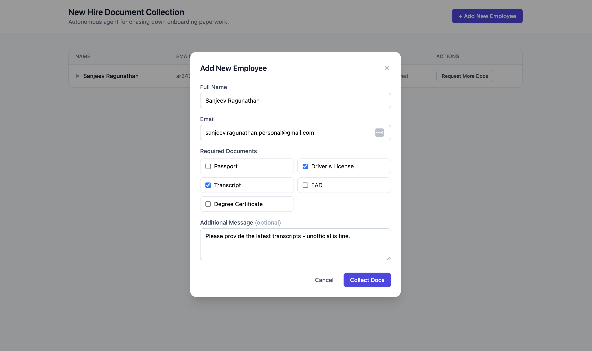
    </td>
    <td align="center" width="50%">
      <strong>2. Initial Document Request</strong>  
      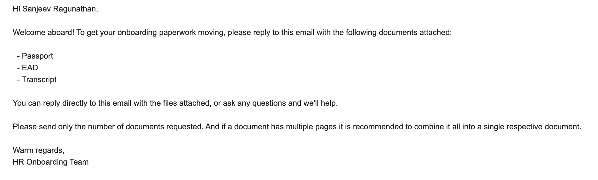
    </td>
  </tr>
  <tr>
    <td align="center" width="50%">
      <strong>3. Request Additional Documents</strong>  
      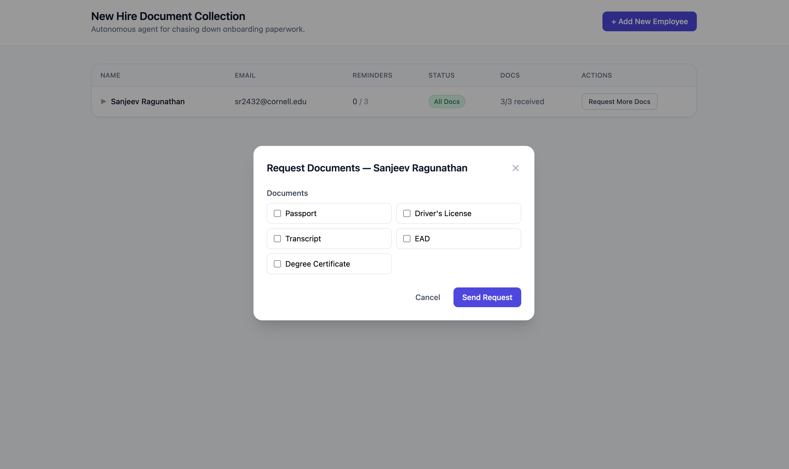
    </td>
    <td align="center" width="50%">
      <strong>4. All Documents Received & Validated</strong>  
      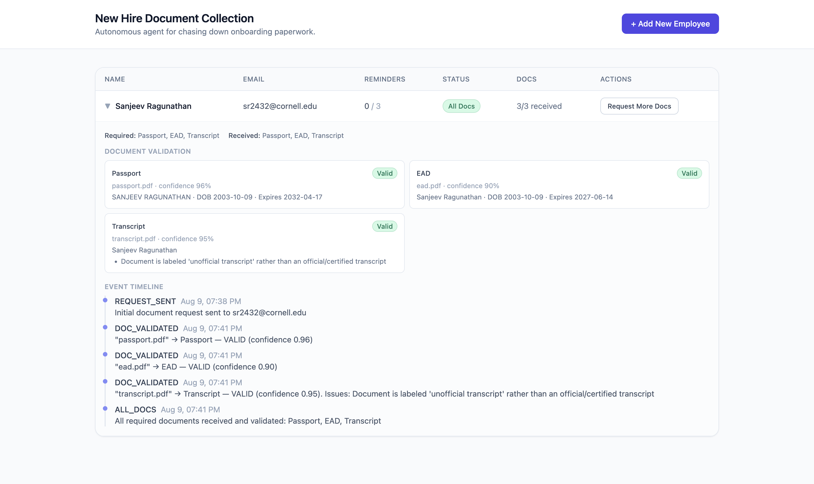
    </td>
  </tr>
</table>

### Automated Employee Communication

<table>
  <tr>
    <td align="center" width="50%">
      <strong>Agent Answers In-Scope Employee Questions</strong>  
      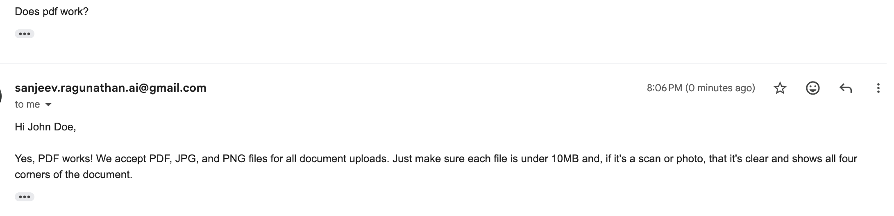
    </td>
    <td align="center" width="50%">
      <strong>Out-of-Scope Question → HR Intervention</strong>  
      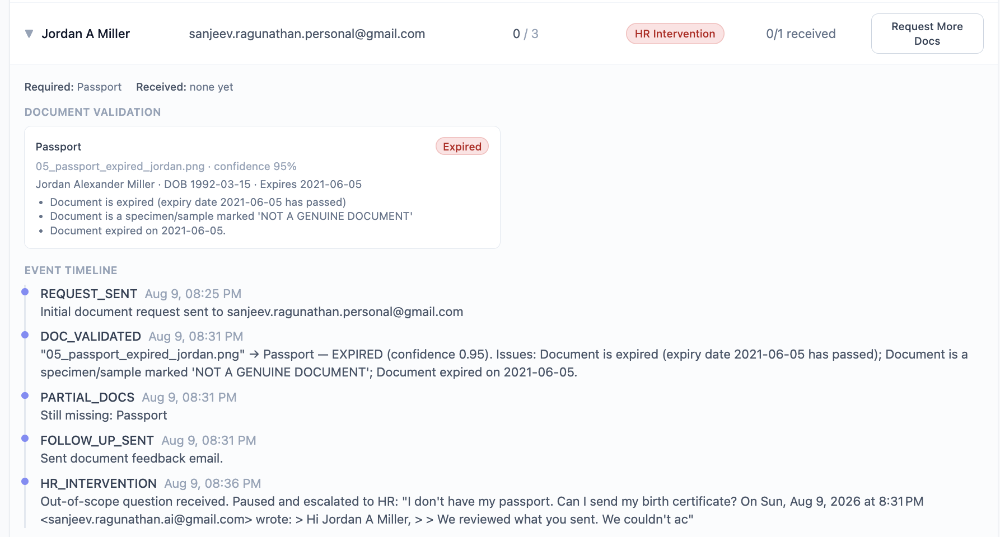
    </td>
  </tr>
</table>

### Document Validation

<table>
  <tr>
    <td align="center" width="50%">
      <strong>Document Validation & Follow-Up Email</strong>  
      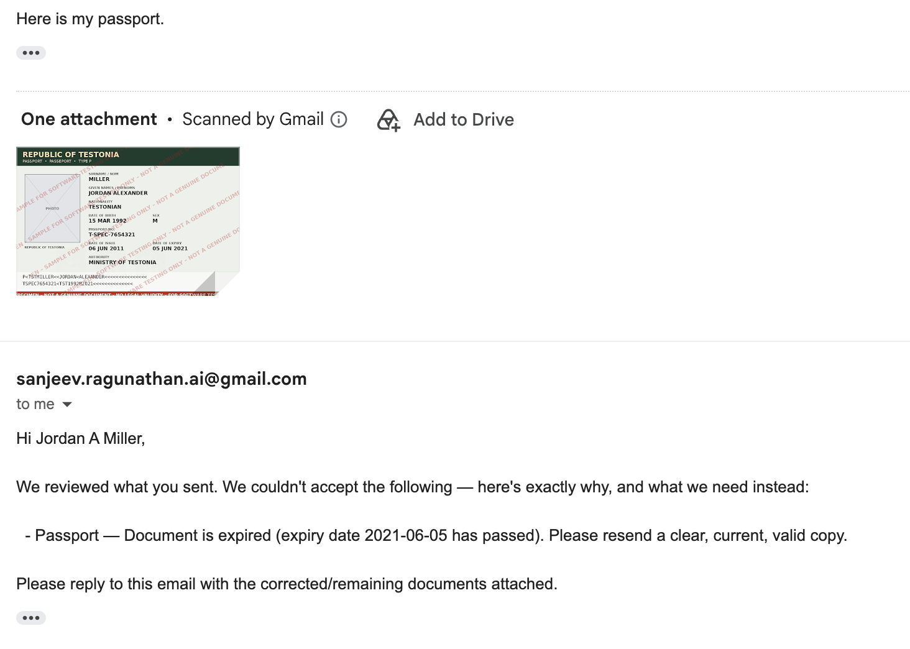
    </td>
    <td align="center" width="50%">
      <strong>Wrong Document Identified</strong>  
      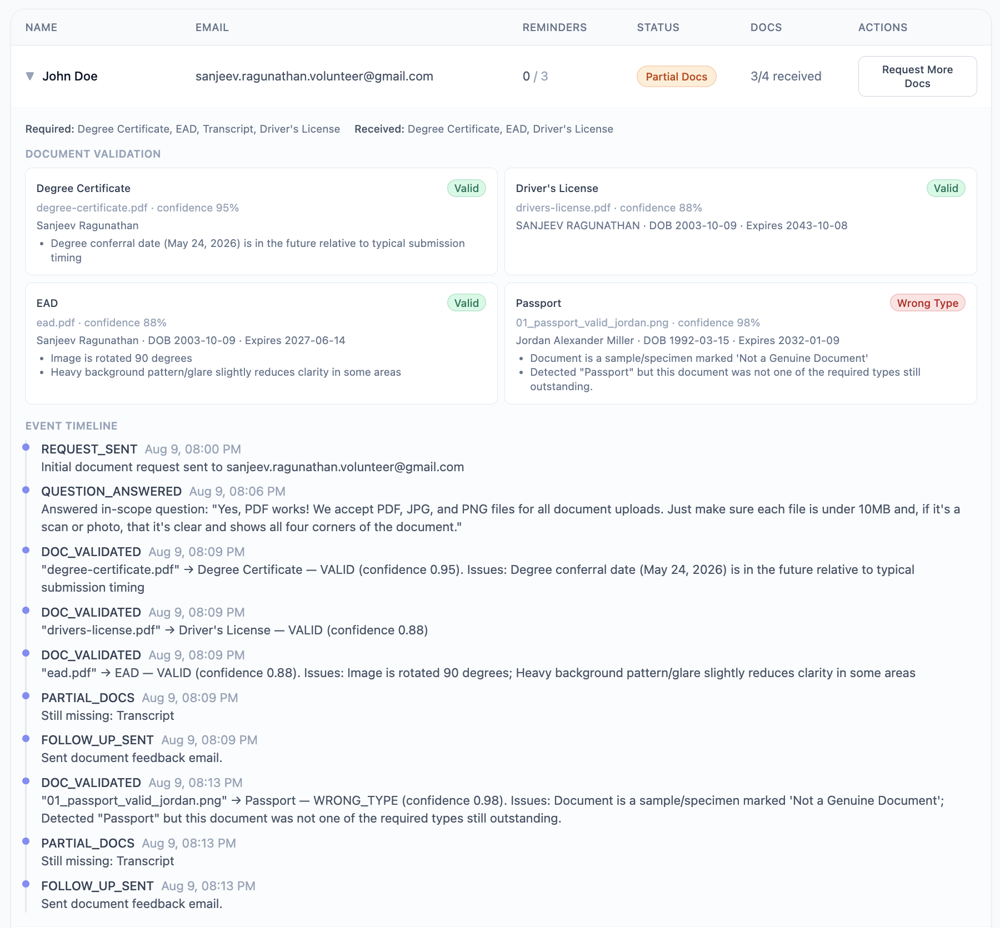
    </td>
  </tr>
  <tr>
    <td align="center" width="50%">
      <strong>Expired Document Detected</strong>  
      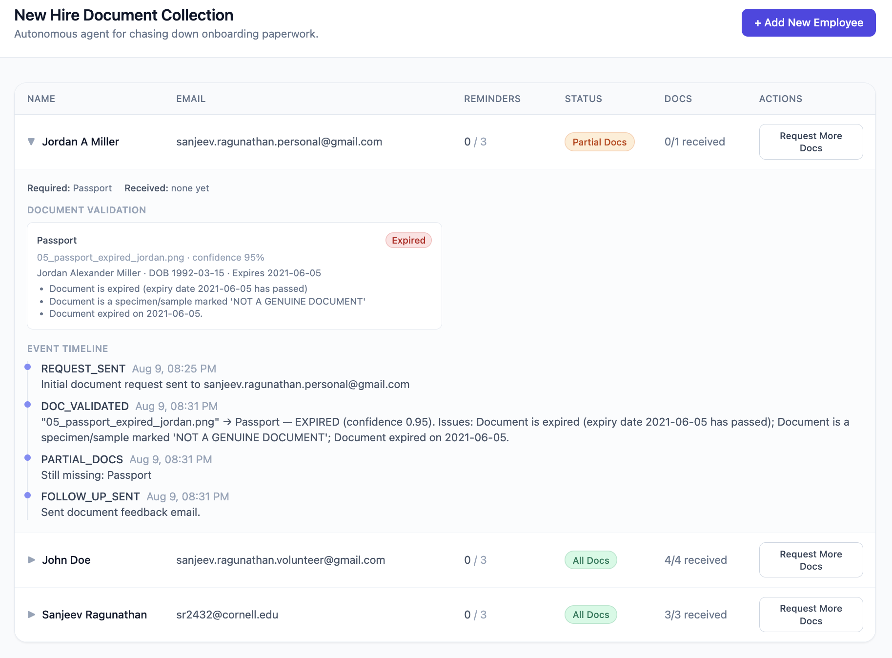
    </td>
    <td align="center" width="50%">
      <strong>Too Many Documents Submitted</strong>  
      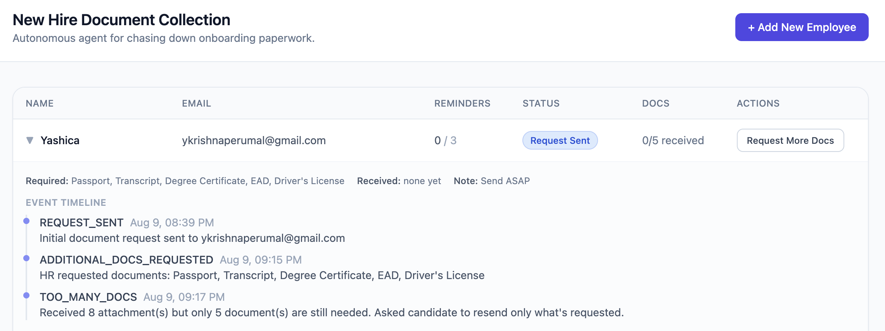
    </td>
  </tr>
</table>

### Guardrails

<table>
  <tr>
    <td align="center" width="50%">
      <strong>Duplicate Employee Email Prevented</strong>  
      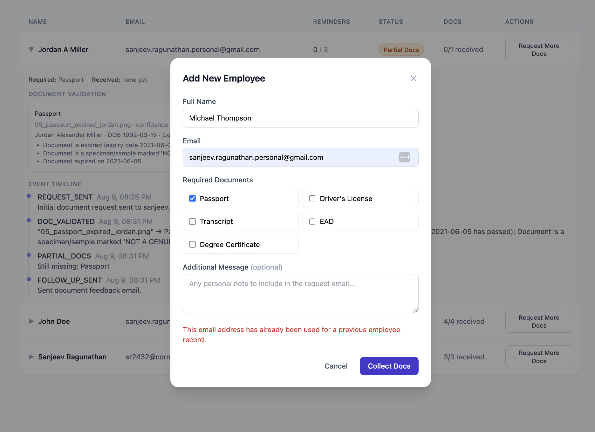
    </td>
    <td width="50%"></td>
  </tr>
</table>
