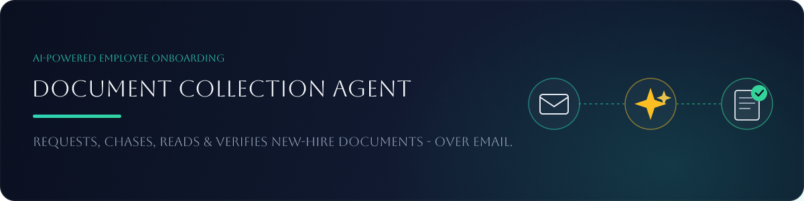

## Features

- Emails new hires requesting the exact documents you specify
- Sends automatic reminders on a schedule, and escalates to HR if a candidate goes quiet
- Reads inbox replies and figures out what they mean — a question, a document submission, or neither
- Answers in-scope questions straight from your SOP doc; hands off anything else to HR
- Validates every submitted document with Claude — checks type, legibility, expiration, and extracts name/DOB/expiry/document number
- Cross-checks identity across a candidate's documents and flags duplicates
- Never stores the actual document files — only the structured validation result
- Names the exact problem and asks for that specific document back (wrong type, expired, unreadable)
- Never auto-rejects a judgment call — identity mismatches and low-confidence reads always go to a human
- Blocks resubmitting too many documents at once without wasting an AI call
- Prevents reusing the same candidate email for a new record
- Keeps every email in one Gmail thread instead of starting new conversations
- Lets HR request extra documents at any time, beyond the original request
- One dashboard: live status badges, per-document validation results, and a full event timeline per candidate

## Run

### 1. Create a Gmail App Password

The agent sends and reads mail through a real Gmail inbox, so you need an App Password (not your
normal Gmail password):

1. Go to your [Google Account](https://myaccount.google.com/) → **Security**.
2. Under "How you sign in to Google," enable **2-Step Verification** if it isn't already on
   (App Passwords require it).
3. Search for **App Passwords** (or go directly to
   [myaccount.google.com/apppasswords](https://myaccount.google.com/apppasswords)).
4. Create a new app password — name it something like "HR Doc Agent" — and copy the 16-character
   code Google gives you (spaces don't matter).
5. Also confirm IMAP is enabled: Gmail → Settings (gear icon) → **See all settings** → **Forwarding
   and POP/IMAP** → make sure **IMAP is enabled**.

You'll use your Gmail address and this app password in `.env` below.

### 2. Configure `.env`

Copy the example and fill in your values:

```bash
cp .env.example .env
```

```env
ANTHROPIC_API_KEY=sk-ant-...
GMAIL_USER=youraddress@gmail.com
GMAIL_APP_PASSWORD=xxxxxxxxxxxxxxxx
IMAP_HOST=imap.gmail.com
SMTP_HOST=smtp.gmail.com

# These simulate the real "2 days between reminders" cadence, compressed to
# minutes so the whole flow is demoable in one sitting. Change these, not
# hardcoded intervals in code, to slow the demo down or speed it up.
FIRST_REMINDER_MINUTES=2
REMINDER_GAP_MINUTES=2
MAX_REMINDERS=3

# Minimum confidence to auto-accept a document validation; below this it's
# routed to HR for human review instead of being auto-rejected
CONFIDENCE_THRESHOLD=0.6

# How often the background cron worker runs one agent cycle automatically
POLL_CRON=*/1 * * * *
```

The `.env` file lives at the repo root — both the server (which reads it) and the demo scripts
expect it there.

### 3. Install and start

```bash
npm install        # installs root + server + client workspaces
npm run dev         # runs the API server (with cron worker) and the Vite dev server together
```

- Server: http://localhost:4000
- Client: http://localhost:5173 (proxies `/api/*` to the server)

The SQLite database (`server/data.sqlite`) is created automatically on first boot — nothing to
seed. Every demo run starts from a clean slate unless you delete this file yourself
(`rm server/data.sqlite*`).

Everything runs automatically once started — the cron worker ticks every `POLL_CRON` interval
(default every minute) checking for due reminders and unread replies. To force a cycle
immediately instead of waiting for the next tick (handy for demos), trigger it manually:

```bash
curl -X POST http://localhost:4000/tick
```

## Demo Script

This walks through the full loop: initial request → reminder → a candidate question (both in-scope
and out-of-scope) → document validation (valid, wrong-type, expired, and a name mismatch across two
docs) → all docs. Use a second real email address you control (e.g. a personal Gmail) to play the
"candidate" and reply to the agent's emails from there. After each step, either wait for the next
`POLL_CRON` tick or run `curl -X POST http://localhost:4000/tick` to trigger it immediately.

### Step 1 — Initial request email

1. Open the app, click **+ Add New Employee**.
2. Fill in the candidate's name, use an email address you control, check 2–3 documents (e.g.
   Passport, Transcript), optionally add a note, click **Collect Docs**.
3. Within a few seconds the table shows the new row with status **Request Sent**. Check the
   candidate's inbox — they've received a welcome email listing the required docs.
4. Click the row to expand the event timeline and confirm a `REQUEST_SENT` event logged.

### Step 2 — A reminder fires automatically

1. Wait `FIRST_REMINDER_MINUTES` (default 2 minutes) without replying, then trigger a tick.
2. Status flips to **Reminder Sent**, the reminder count increments, and a new reminder email
   lands in the candidate's inbox listing exactly what's still outstanding.

### Step 3a — Ask an in-scope question

1. From the candidate's inbox, reply to any of the agent's emails asking something covered by
   `server/sop.md` — e.g. *"What file formats do you accept for documents?"*
2. Trigger a tick so the agent polls the inbox.
3. The candidate receives a direct, SOP-grounded answer by email. Status and reminder cadence are
   unaffected — the agent does **not** pause for in-scope questions. Expand the timeline to see a
   `QUESTION_ANSWERED` event.

### Step 3b — Ask an out-of-scope question

1. Reply again with something not covered by the SOP — e.g. *"Can I negotiate my start date?"*
2. Trigger a tick.
3. Status flips to **HR Intervention** and the row pauses (no more reminders will be sent). The
   timeline shows an `HR_INTERVENTION` event with the question that triggered it, ready for a
   human to pick up.

   → Start a fresh employee row for the remaining steps, since this one is now paused.

### Step 4 — A valid document, but not all of them

1. Reply to the request email with **one genuinely valid document** attached (a real or realistic
   passport/license/transcript image or PDF — Claude actually reads it, so a blank or placeholder
   file will come back `ILLEGIBLE`).
2. Trigger a tick.
3. Status flips to **Partial Docs**, and the candidate receives a feedback email listing what's
   still outstanding. Expand the row — the **Document Validation** panel shows a green `VALID`
   badge for the submitted doc with its extracted name/DOB/expiry and confidence score. A
   `DOC_VALIDATED` event is logged.

### Step 4b — A wrong-type document

1. Reply with a document that doesn't match anything still outstanding for this candidate (e.g.
   send a Driver's License when only a Passport and Transcript are required).
2. Trigger a tick.
3. The validation panel shows a red `WRONG_TYPE` badge with the mismatch explained in the issues
   list. It is **not** marked received — the candidate gets a feedback email naming the exact
   issue and asking specifically for a corrected resubmission, without disturbing anything already
   valid.

### Step 4c — An expired document

1. Reply with a document whose expiration date (visible on the document itself) is in the past.
2. Trigger a tick.
3. The validation panel shows a red `EXPIRED` badge, the extracted expiration date, and an issue
   noting it's expired. The candidate receives a feedback email asking for a current copy — same
   single-document resubmission flow as Step 4b.

### Step 4d — A name mismatch across two documents

1. With a candidate who has already had one document validated as `VALID` (from Step 4), reply
   with a **second** document showing a clearly different full name or date of birth.
2. Trigger a tick.
3. Status flips to **HR Intervention** — identity mismatches are never auto-rejected, they always
   route to a human. The validation panel shows an amber `INCONSISTENT` badge naming which prior
   document it conflicts with. No automated email is sent; this is meant to be picked up by a
   person.

   → Start a fresh employee row for the remaining step, since this one is now paused.

### Step 5 — All documents received and valid

1. Reply with valid copies of every required document (across one or more emails, as needed).
2. Trigger a tick after each.
3. Once every required document has a `VALID` verdict, status flips to **All Docs** (green badge)
   — onboarding document collection is complete, no further agent action will be taken on this
   employee. The validation panel shows a green badge for every required document.

**Bonus:** click **Request More Docs** on any row to ask that candidate for something outside the
original list — it restarts the same request/reminder cycle for just the new document(s).

## Workflow Diagram

```
HR adds employee (name, email, required docs)
        │
        ▼
Initial request email sent ──────────────► status: REQUEST_SENT
        │
        ├── no reply in time ──► reminder email sent ──► status: REMINDER_SENT
        │         │                                            │
        │         └── repeats up to MAX_REMINDERS ──► still nothing ──► status: HR_INTERVENTION
        │
        └── candidate replies
                │
                ▼
        Claude classifies the email
                │
        ┌───────┼────────────────┐
        ▼                        ▼
    question                 documents attached
        │                        │
   in-scope? ──yes──► answered   ├── too many attached ──► "send only what's needed" email
        │                        │
        no                       ▼
        │                Claude validates each doc
        ▼                        │
  status: HR_INTERVENTION   ┌────┼─────────────────────┐
  (needs a human)           ▼    ▼                      ▼
                          VALID  WRONG_TYPE/EXPIRED/   INCONSISTENT/
                            │    ILLEGIBLE              LOW_CONFIDENCE
                            │      │                      │
                     counts as   feedback email        status: HR_INTERVENTION
                     received    naming the exact       (never auto-rejected —
                            │    issue + resend ask      always a human call)
                            │      │
                            └──────┘
                                │
                    all required docs VALID?
                        │              │
                       yes             no
                        │              │
                        ▼              ▼
                 status: ALL_DOCS   status: PARTIAL_DOCS
                 (done, no more     (rejoins the normal
                  reminders)         reminder cadence)

HR can, at any time: click "Request More Docs" to ask for
extra documents outside the original list — restarts the
same request/reminder flow for just those docs.
```

This is exactly what `runTick()` (`server/src/agent/tick.ts`) does on every cron cycle: run the
reminder engine, then poll the inbox and classify/validate anything new.